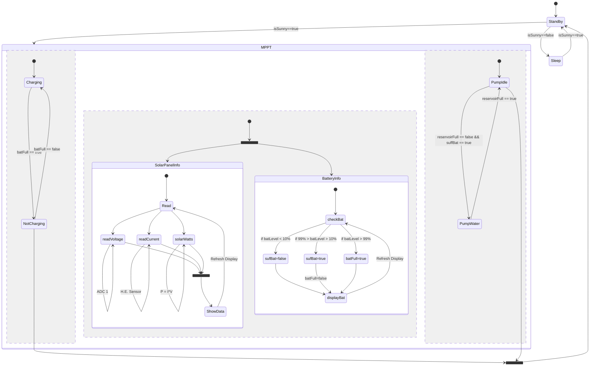

# SolarIrrigation
This repository will have all firmware related resources pertaining to Team 8's Capstone project.

What is in this repo is subject to change, but as of writing it is a PlatformIO project designed for the Arduino Uno.
The eventual goal is the amalgamation of every subsystem into a single PCB, if possible.
Below is a state machine that is *IN PROGRESS*, so it is subject to change as our project develops.

State Machine:
