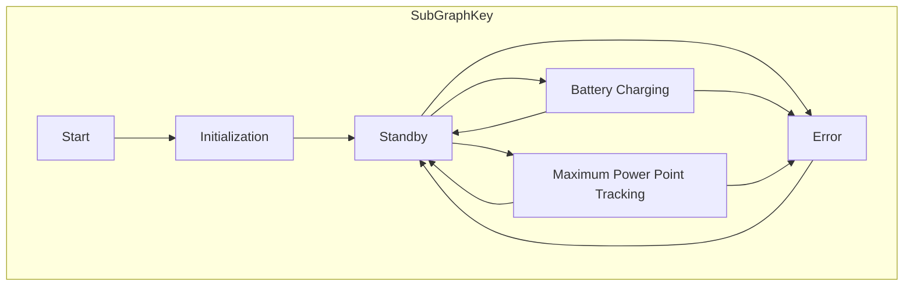

# SolarIrrigation
This repository will have all firmware related resources pertaining to Team 8's Capstone project.

State Machine:

```mermaid
graph TD
  Start --> Initialization
  Initialization --> Standby
  Standby --> MPPT
  MPPT --> Standby
  Standby --> Charging
  Charging --> Standby
  Standby --> Error
  Charging --> Error
  MPPT --> Error
  Error --> Standby

  subgraph SubGraphKey
    Start[Start]
    Initialization[Initialization]
    Standby[Standby]
    MPPT[Maximum Power Point Tracking]
    Charging[Battery Charging]
    Error[Error]
  end

  click Standby "reservoirFull ?" "Enter Standby if reservoirFull condition is fulfilled"
  click MPPT "reservoirFull ?" "Enter Standby if reservoirFull condition is fulfilled"
  click Charging "reservoirFull ?" "Enter Standby if reservoirFull condition is fulfilled"
  click Error "reservoirFull ?" "Enter Standby if reservoirFull condition is fulfilled"

```